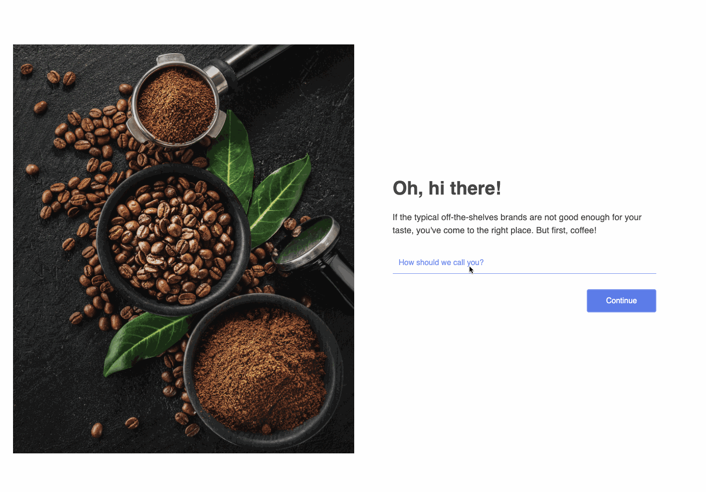

# Constructor.io Quizzes UI Library

A UI Library that provides React components to manage the fetching and rendering logic for [Constructor.io's Quizzes](https://constructor.io/products/quizzes/). 

## Introduction

[Constructor.io's Quizzes](https://constructor.io/products/quizzes/) are interactive experiences that personalizes the shopping journey for each of your customers. This UI library simplifies the integration process by providing React Components that handle the fetching and rendering logic for Quizzes. Typescript support is available.

[Our storybook docs (_PENDING_)]() are the best place to explore the behavior and the available configuration options for this UI Library.



## Using the Library

The `CioQuiz` component handles state management, data fetching, and rendering logic for the entire quiz.

```jsx
import { CioQuiz } from 'cio-quizzes-ts';

function YourComponent() {
  return (
    <div>
      <CioQuiz quizId="coffee-quiz" apiKey="key_jaqzPcUDnK66puIO" />
    </div>
  );
```

## Custom Styling

### Library defaults

This library provides some default styles. These default styles can be used as a foundation to build on top of or just as a reference for you to replace completely. All default styles in this library are defined as css classes that are scoped with the `.cio-` prefix.

## Local Development

### Development scripts

```bash
npm ci                  # install dependencies for local dev
npm run dev             # start a local dev server for Storybook
npm run lint            # run linter
```

### Maintain Library

```bash
npm run compile           # generate lib folder for publishing to npm
npm run build-storybook   # generate storybook static bundle for deploy with GH Pages
```

## Supporting Docs

- [Storybook 7 Introduction](https://storybook.js.org/docs/7.0/react/get-started/introduction)
- [Typescript Docs](https://www.typescriptlang.org/docs/)

